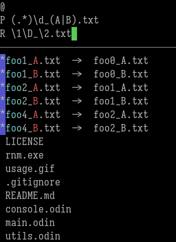

# Rename Man (rnm)

**rnm** is a small tool to batch rename files with regular expressions in TUI.
It is written in [Odin Lang](https://odin-lang.org/) and currently supports **Windows only**.
Other platforms' support is planned in the future.

## Usage


Edit the **regex pattern** and **replacement** fields interactively.
Then press `Enter` to apply the operation.

In replacement string, use `\1`, `\2`, `\3`... to apply the capture.
Also, you can use `\D` to insert auto index among repeated results.



### Keys

| Key          | Action                                        |
|--------------|-----------------------------------------------|
| `Tab`        | Switch between pattern and replacement fields |
| `Ctrl-N`     | Scroll down the preview list                  |
| `Ctrl-P`     | Scroll up the preview list                    |
| `Ctrl-E`     | Insert a pair of parentheses `()`             |
| `Ctrl-H`     | Expand the capture range to the left          |
| `Ctrl-L`     | Expand the capture range to the right         |
| `Ctrl-X/Q/C` | Cancel                                        |

### Regex rule

The regex is implemented by Odin's regex package. [Regex Rule](https://pkg.odin-lang.org/core/text/regex/)

## Build

To build the project:

```
odin build .
```

## TODO

- Support on linux and mac
X Auto index repeated filenames
- Copy and Paste
- Format captured string before insert
- Insert file date and time
- Single-file renaming mode
- Command: confirm and don't exit